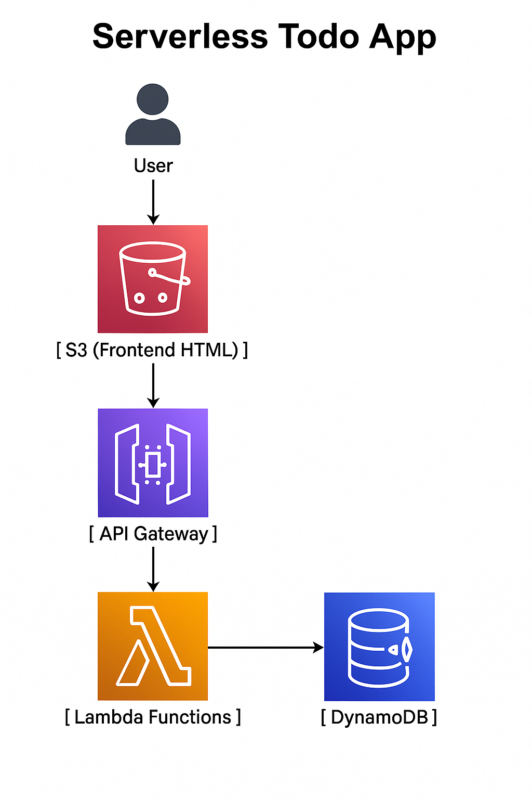

# Serverless REST API with AWS Lambda, API Gateway, and DynamoDB

## Project Overview
This project demonstrates a fully serverless REST API to manage a simple to-do list (tasks) using AWS services.  
It supports full CRUD operations (Create, Read, Update, Delete) on tasks with minimal infrastructure management.

## Architecture
The solution architecture consists of:

- **API Gateway**: Provides RESTful endpoints to expose the API to clients.
- **AWS Lambda**: Implements the backend logic for handling API requests.
- **Amazon DynamoDB**: Serves as the NoSQL database for storing tasks.
- **IAM Roles**: Securely grant Lambda functions permissions to access DynamoDB.



## Features
- **Create Task** (POST `/tasks`): Add a new task with a title.
- **Get All Tasks** (GET `/tasks`): Retrieve all existing tasks.
- **Update Task** (PUT `/tasks/{id}`): Modify the title of a specific task.
- **Delete Task** (DELETE `/tasks/{id}`): Remove a task by its ID.

## Deployment Instructions

1. **Create DynamoDB Table**  
   - Table name: `Tasks`  
   - Primary key: `id` (String)

2. **Deploy Lambda Function**  
   - Use the provided `lambda_function.py` code.  
   - Attach an IAM role to the Lambda function with appropriate permissions to access DynamoDB.

3. **Configure API Gateway**  
   - Create REST API with resources:  
     - `/tasks` supporting methods POST, GET  
     - `/tasks/{id}` supporting methods PUT, DELETE  
   - Integrate each method with the Lambda function.  
   - Enable CORS on the API methods if calling from web browsers.

4. **Set IAM Permissions**  
   The Lambda function’s execution role must have the following DynamoDB permissions on the `Tasks` table:

   ```json
   {
     "Effect": "Allow",
     "Action": [
       "dynamodb:PutItem",
       "dynamodb:GetItem",
       "dynamodb:Scan",
       "dynamodb:UpdateItem",
       "dynamodb:DeleteItem"
     ],
     "Resource": "arn:aws:dynamodb:<region>:<account-id>:table/Tasks"
   }
Testing the API
You can test the API endpoints using tools like Postman or curl:

bash
Copy
Edit
# Create a task
curl -X POST https://your-api-endpoint/tasks -H "Content-Type: application/json" -d '{"title": "Finish AWS project"}'

# Get all tasks
curl https://your-api-endpoint/tasks

# Update a task
curl -X PUT https://your-api-endpoint/tasks/{id} -H "Content-Type: application/json" -d '{"title": "Updated task title"}'

# Delete a task
curl -X DELETE https://your-api-endpoint/tasks/{id}
Replace https://your-api-endpoint with your actual API Gateway invoke URL and {id} with the task ID.

Code Structure
lambda_function.py: Contains the Lambda handler implementing the API logic.

architecture-diagram.png: Visual diagram of the solution architecture.

README.md: This documentation file.

Conclusion
This project showcases a scalable, cost-effective, and serverless REST API solution leveraging AWS Lambda, API Gateway, and DynamoDB. It highlights best practices for:

Designing event-driven serverless applications.

Securing AWS resources with IAM roles and policies.

Building scalable and maintainable backend services without managing servers.

Author: Your Name
Email: yuributterfly3@gmail.com
LinkedIn: [https://www.linkedin.com/in/yourprofile/](https://www.linkedin.com/in/yara-alalawi-76a3952b3/?originalSubdomain=sa)
